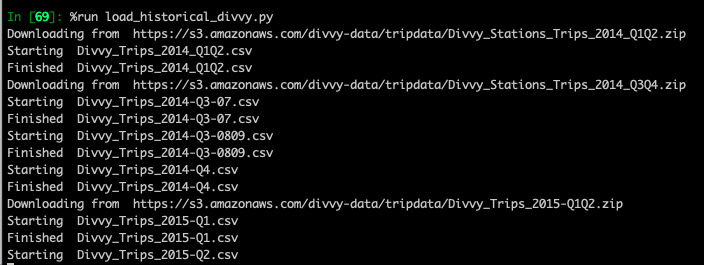

# DivvyBikes Database

This repo contains scripts for creating a database used for the group assignment
of MScA 31012: Data Engineering Platforms.

The assignment is to build a coherent analysis from publicly available data. We
chose to use the Divvy and CTA data to find locations that would be good spots
to place electric scooter charging stations.

## Local Setup

1. Create divvy database

Open MySQLWorkbench local connection

Run divvy_schema.sql 

2. Fill local db with stations data

make a copy of config.yml.example and name it config.yml

    cp config.yml.example config.yml

Enter your own local username/password in the config file

Install python packages

    pip install -r requirements.txt

Run the script

	python parse_stations_json.py

Check that the data has been loaded in MySQLWorkbench

	select count(*) from stations

3. Fill local db with trips data

The trips data is released by Divvy each quarter in the form of a zip drive
containing multiple csvs. You must download the zips, unzip them, then load
the data into the database. While the json stations data is only 600 or so lines,
the trips data contains millions of records. Filling the `trips` table locally
will take a few hours. Filling it remotely might take all day. If the connection
times out then comment out the urls that have been downloaded and rerun.

    python load_historical_divvy.py

